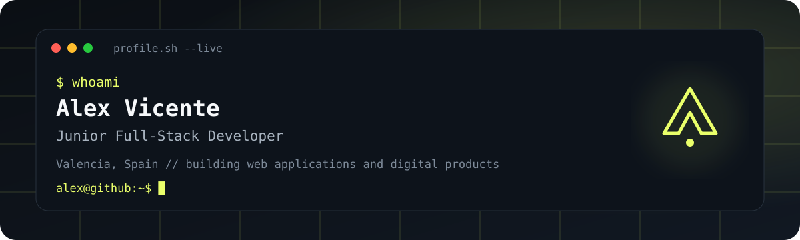
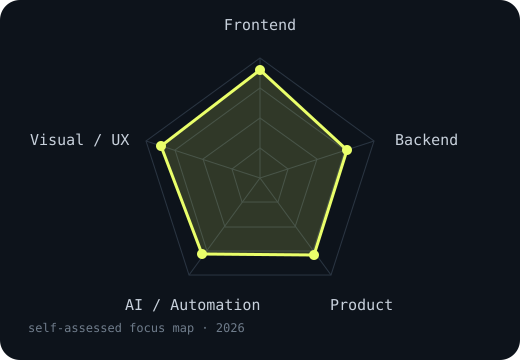
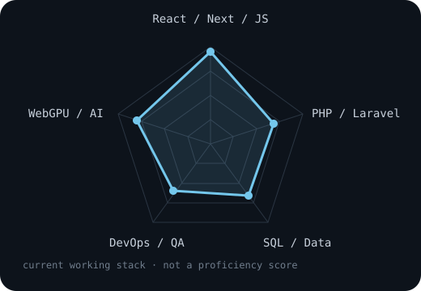

<picture>
  <source media="(prefers-color-scheme: dark)" srcset="assets/banner-dark.svg">
  <source media="(prefers-color-scheme: light)" srcset="assets/banner-light.svg">
  
</picture>

 

 

&nbsp;
&nbsp;
&nbsp;

  

---

## About me

I'm **Alex Vicente**, a Full-Stack Developer based in Valencia, Spain. I build software end to end: from data models and APIs to interfaces, testing, deployment and the details that make a product feel intentional.

My current work sits at the intersection of **full-stack engineering, AI-assisted development and visual design**. I use AI as an engineering tool to explore ideas faster, automate repetitive work and prototype new workflows, while keeping architecture, verification and product decisions explicit.

- **Frontend:** React, Next.js, TypeScript, JavaScript, Tailwind CSS and GSAP.
- **Backend:** PHP, Laravel, Python, FastAPI, MySQL and REST APIs.
- **Product engineering:** authentication, testing, accessibility, SEO, CI/CD and deployment.
- **AI / local inference:** WebGPU, computer vision and offline creative workflows.
- **Creative side:** photography, motion and interactive web experiences through **[raw.vives](https://rawvives.aleviclop.dev)**.

> I care about software that is technically solid, visually intentional and useful outside a demo environment.

---

## Core stack

 

<table>
<tr>
<td width="25%" valign="top"><b>Frontend</b> React · Next.js · TypeScript · Tailwind · GSAP</td>
<td width="25%" valign="top"><b>Backend</b> Laravel · PHP · Python · FastAPI · MySQL</td>
<td width="25%" valign="top"><b>Quality</b> Git · Vitest · PHPUnit · Playwright · ESLint</td>
<td width="25%" valign="top"><b>Delivery</b> Docker · Vercel · Cloudflare · GitHub Actions</td>
</tr>
</table>

---

## Engineering signals

<table>
<tr>
<td width="50%" align="center" valign="middle">
<picture>
  <source media="(prefers-color-scheme: dark)" srcset="assets/radar-skills-dark.svg">
  <source media="(prefers-color-scheme: light)" srcset="assets/radar-skills-light.svg">
  
</picture>
</td>
<td width="50%" align="center" valign="middle">
<picture>
  <source media="(prefers-color-scheme: dark)" srcset="assets/radar-stack-dark.svg">
  <source media="(prefers-color-scheme: light)" srcset="assets/radar-stack-light.svg">
  
</picture>
</td>
</tr>
</table>

These charts describe where I currently spend most of my time; they are not proficiency scores.

---

## Selected work

<table>
<tr>
<td width="50%" valign="top">

01 · PRODUCT + LOCAL AI

### [LumaFlow Studio ↗](https://github.com/AVL05/lumaflow-studio)

Photography-studio operations platform covering clients, sessions, calendar, quotes, invoices, galleries and analytics, with local AI-assisted workflows integrated into the product.

`React 19` `Laravel 13` `MySQL` `WebGPU` `Docker`

</td>
<td width="50%" valign="top">

02 · FULL-STACK PRODUCT

### [Distrito Gourmet ↗](https://github.com/AVL05/distrito-gourmet)

Decoupled restaurant application connecting digital menu, reservations, ordering and administration in one complete workflow.

`React 19` `Laravel 12` `MySQL` `Sanctum` `Docker`

**[Live demo ↗](https://distrito.aleviclop.dev/)**

</td>
</tr>
<tr>
<td width="50%" valign="top">

03 · PHOTOGRAPHY + INTERACTIVE WEB

### [raw.vives ↗](https://github.com/AVL05/alexgallery)

Bilingual photographic archive built around series, discovery, contextual navigation, accessibility, localized SEO and a cinematic visual direction.

`Next.js 16` `TypeScript` `GSAP` `Three.js` `Cloudflare`

**[Visit gallery ↗](https://rawvives.aleviclop.dev)**

</td>
<td width="50%" valign="top">

04 · PERSONAL PLATFORM

### [aleviclop.dev ↗](https://github.com/AVL05/Portfolio)

Bilingual portfolio where projects are presented as case studies, with a responsive, accessible and production-oriented foundation.

`Next.js 16` `React 19` `TypeScript` `Tailwind CSS` `Playwright`

**[Visit portfolio ↗](https://aleviclop.dev)**

</td>
</tr>
</table>

---

## What I'm building now

### AI Creative Assistant

A desktop creative pipeline focused on automating media analysis and short-form video assembly locally. This is where I'm experimenting most heavily with **AI-assisted engineering, computer vision, WebGPU, Python inference and desktop delivery**.

`Tauri 2` `Rust` `React 19` `TypeScript` `Python` `FastAPI` `WebGPU`

Private work in progress.

### Nuvora

A product and brand project focused on the connection between **software engineering, product design, identity and real client-facing delivery**.

Private while the product and positioning are being developed.

---

## GitHub activity

  

---

## Beyond code

Photography has a direct influence on how I build interfaces: hierarchy, rhythm, contrast, composition and attention to detail. I develop that work under **raw.vives**, my independent photography identity.

The same principle applies to software: implementation matters, but so does how the product communicates, feels and behaves.

---

### Open to junior Full-Stack / Frontend opportunities and selected freelance projects.

  &nbsp;
  &nbsp;
  

<code>Valencia, Spain · On-site · Hybrid · Remote</code>

  

Built with code, curiosity and an unnecessary amount of attention to detail.

