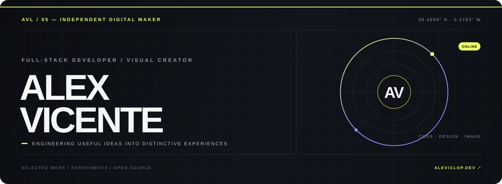

<div align="center">
  
</div>

<div align="center">
  <a href="https://aleviclop.dev"></a>
  <a href="https://www.linkedin.com/in/aleviclop"></a>
  <a href="mailto:alexviclop@gmail.com"></a>
</div>

<br />

## I build full-stack products that solve real workflows.

I'm **Alex Vicente**, a DAW graduate and full-stack developer based in Valencia, Spain. I build maintainable web products with **React, Laravel, PHP and MySQL**, combining practical engineering with strong visual judgement.

I have professional experience modernising internal tools with **React, PHP and Electron**, working with databases and collaborating through Git and Bitbucket. I'm currently open to **junior full-stack, frontend React and backend PHP/Laravel opportunities** in Valencia, hybrid or remote.

```text
CURRENT FOCUS
01  React interfaces and product UX          02  Laravel APIs and relational data
03  End-to-end business workflows             04  Maintainable, production-minded delivery
```

My approach is simple: understand the real problem, reduce the noise, and ship something thoughtful.

<br />

## Selected work

<table>
  <tr>
    <td width="50%" valign="top">
      <sup>01 / CREATIVE OPERATIONS</sup>
      <h3><a href="https://github.com/AVL05/raw-manager">RAW Manager ↗</a></h3>
      <p>A full-stack workspace for photographers covering clients, sessions, quotes, invoices, galleries, equipment and production planning.</p>
      <p><code>React 19</code> <code>Laravel 13</code> <code>MySQL</code> <code>PWA</code></p>
    </td>
    <td width="50%" valign="top">
      <sup>02 / HOSPITALITY SYSTEM</sup>
      <h3><a href="https://github.com/AVL05/distrito-gourmet">Distrito Gourmet ↗</a></h3>
      <p>A restaurant platform connecting the customer experience with menus, reservations, orders and internal administration.</p>
      <p><code>React</code> <code>Laravel</code> <code>MySQL</code> <code>Docker</code></p>
    </td>
  </tr>
  <tr>
    <td width="50%" valign="top">
      <sup>03 / DIGITAL IDENTITY</sup>
      <h3><a href="https://github.com/AVL05/Portfolio">Portfolio ↗</a></h3>
      <p>A bilingual portfolio built to present projects as product case studies, with careful interaction design, accessibility and SEO.</p>
      <p><code>Next.js 16</code> <code>TypeScript</code> <code>GSAP</code></p>
    </td>
    <td width="50%" valign="top">
      <sup>04 / VISUAL ARCHIVE</sup>
      <h3><a href="https://github.com/AVL05/alexgallery">Alex Gallery ↗</a></h3>
      <p>A photography-first gallery where interface, atmosphere and imagery work together as a single visual narrative.</p>
      <p><code>Next.js</code> <code>TypeScript</code> <code>Photography</code></p>
    </td>
  </tr>
</table>

## Experience snapshot

- **Web Application Developer Intern · Burguet Sistemas (2026):** migrated and adapted internal applications using React, PHP and Electron; supported database work and version-controlled delivery.
- **Higher Technician in Web Application Development · IES Serra Perenxisa (2024–2026):** frontend, backend, databases, deployment and modern web application architecture.
- **IT Support Technician Intern · Municipal environment (2024):** hardware, software and user incident resolution.

<div align="right">
  <a href="https://github.com/AVL05?tab=repositories"><b>VIEW THE FULL ARCHIVE →</b></a>
</div>

<br />

## The toolkit

<table>
  <tr>
    <td><b>BUILD</b></td>
    <td>JavaScript · TypeScript · React · Next.js · Vue · HTML · CSS</td>
  </tr>
  <tr>
    <td><b>POWER</b></td>
    <td>PHP · Laravel · MySQL · REST APIs · Electron</td>
  </tr>
  <tr>
    <td><b>SHIP</b></td>
    <td>Git · GitHub · Vercel · Docker · CI/CD</td>
  </tr>
  <tr>
    <td><b>CREATE</b></td>
    <td>Lightroom · Photoshop · Premiere Pro · Visual storytelling</td>
  </tr>
</table>

> Technology is only useful when it disappears behind a good experience.

<br />

## Open-source signal

<div align="center">
  
  
</div>

<div align="center">
  
</div>

<br />

---

<div align="center">
  <h3>Looking for a junior developer who can work across the stack?</h3>
  <p>I'm available for full-stack, React and PHP/Laravel opportunities in Valencia, hybrid or remote.</p>
  <p>
    <a href="mailto:alexviclop@gmail.com"><b>START A CONVERSATION</b></a>
    &nbsp;&nbsp;·&nbsp;&nbsp;
    <a href="https://aleviclop.dev"><b>ALEVICLOP.DEV</b></a>
    &nbsp;&nbsp;·&nbsp;&nbsp;
    <a href="https://www.instagram.com/aleviclop"><b>VISUAL JOURNAL</b></a>
  </p>
  <sub>DESIGNED + ENGINEERED FROM VALENCIA · AVL05 © 2026</sub>
</div>
